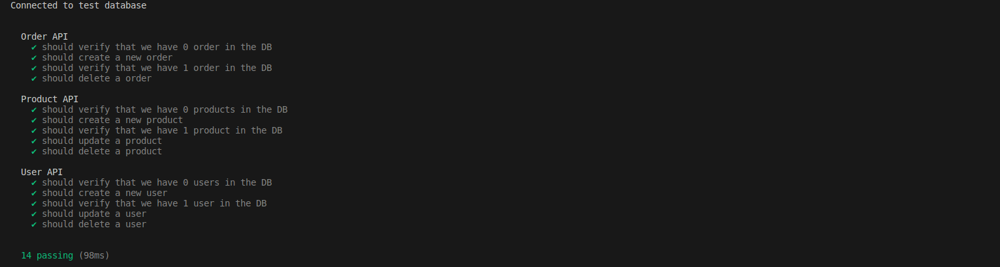

# Start2Impact NodeJs Project

- A Node.js RESTful API platform for managing users, products, and orders, featuring Swagger documentation and unit testing.
- License: MIT

Planty of Food (POF) is a company that aims to make plant-based food more accessible.

## Tech Stack

**Client:** Javascript, Swagger.

**Server:** Nodejs, Express.

**Database:** MongoDB, Mongoose.

**UnitTest:** Chai, Chai-HTTP, Mocha, Sinon and Nyc for test coverage.

## Screenshots

- API DOCUMENTATION

<p align="center">
    
</p>

- TESTING

<p align="center">
    
</p>

## Getting Up and Running Locally

### Clone Repo

```bash
git@github.com:Isacco-B/Start2Impact_Progetto_Nodejs.git
```

### Edit .env.development and .env.test

```bash
NODE_ENV=development
DB_HOST=mongodb://localhost:27017/dev_db
```

```bash
NODE_ENV=test
DB_HOST=mongodb://localhost:27017/test_db
```

### Install all dependencies

```
npm install
```

### Run Dev Server

```
npm run startDev
```

http://localhost:3000/api-docs/

### Run UnitTest

```
npm run test
```

## 🔗 Links

[](https://www.linkedin.com/in/isacco-bertoli-10aa16252/)
